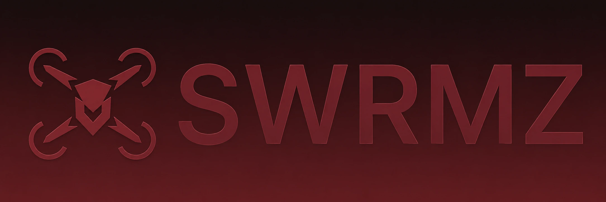

<p align="center">
  <a href="https://swrmz.ai"></a>
</p>

<div align="center">

# SWRMZ

### An Agentic AI Swarm for Cybersecurity

<br/>

<a href="https://swrmz.ai"></a>
<a href="https://swrmz.ai/login"></a>
<a href="https://github.com/YUST777/swrmz/issues"></a>
<a href="https://x.com/swrmz"></a>
<a href="https://www.linkedin.com/company/swrmz"></a>

</div>

<br/>

> [!NOTE]
> **SWRMZ is currently in beta.** Request [early access](https://swrmz.ai/login) to get on the platform when we launch.

---

## What is SWRMZ?

SWRMZ is a swarm of specialized AI security agents that continuously **find** vulnerabilities, **fix** them automatically, **report** every action, and **guard** your logs around the clock. Built on Band.ai. One swarm, zero blind spots.

**The problem:** Security tooling floods you with alerts, most of which are noise. Developers tune them out. Vulnerabilities slip through. Breaches happen.

**Our solution:** A coordinated swarm of agents that understands your stack contextually, validates real threats through exploitation, opens fix PRs automatically, and keeps watch — before attackers find what you missed.

---

## Key Capabilities

### Detect — Continuous Vulnerability Scanning
Point the swarm at your repos, cloud, and log streams and it works nonstop:
- **Deep analysis** across code, dependencies, and infrastructure
- **Validated findings** — recon, analysis, then real exploitation, so no exploit means no report
- **Zero configuration** — agents map your attack surface in minutes

### Remediate — Automated Fixes
Detection without remediation is just a to-do list. SWRMZ fixes what it finds:
- **Auto-generated PRs** with safe, reviewable code changes
- **Contextual fixes** that respect your codebase patterns
- **Approval policy** — auto-apply what you trust, review the rest

### Report — Audit-Ready Output
Every finding, exploit proof, and fix is documented for you:
- **SARIF output** and executive summaries
- **Remediation plans** ready to hand to auditors
- **Full history** of what changed and why

### Guard — Always-On Protection
Security isn't a one-time scan. The swarm runs as long as your stack evolves:
- **Real-time log watching** with anomaly detection
- **Threat lockdown** before issues spread
- **Drift detection** as your codebase grows

---

## How It Works

```
1. Deploy   →  Point SWRMZ at your repos, cloud, and log streams
2. Recon    →  Agents map your attack surface in minutes
3. Detect   →  Real vulnerabilities surfaced, noise filtered
4. Fix      →  Automated PRs with secure replacements
5. Guard    →  Continuous monitoring, reporting, and lockdown
```

## Band.ai Hackathon Flow

SWRMZ uses Band as the real coordination layer for the desktop scan flow, not as a final notification channel.

- The Electron app authenticates as a Band Operator and creates a fresh Band room for each scan.
- The Operator recruits three registered Band remote agents: `SWRMZ Analyst`, `SWRMZ Fixer`, and `SWRMZ Reviewer`.
- The scan request is posted into that Band room. Analyst hands findings to Fixer, Fixer hands patch context to Reviewer, and Reviewer signs off through Band mentions.
- The app shows the live Band room id and mirrors the room transcript beside the local scan/fix engine so the handoffs are visible to the user and auditable in the saved session.

Relevant source: [app/electron/band_bridge.cjs](app/electron/band_bridge.cjs), [app/electron/main.cjs](app/electron/main.cjs), and [band_agents/](band_agents/).

Local proof command, after configuring the four Band keys and starting `band_agents/run.py`:

```bash
node app/electron/smoke_band_flow.cjs
```

It creates a temporary vulnerable repo, opens a real Band room, waits for Operator → Analyst → Fixer → Reviewer messages, and prints the room id plus sender summary.

---

## Tech Stack

| Layer | Technology |
|---|---|
| **Framework** | React 19, TypeScript, Vite |
| **Routing** | TanStack Router |
| **Styling** | Tailwind CSS v4 |
| **Animation** | Framer Motion |
| **Icons** | Lucide |
| **AI Engine** | Band.ai (separate service) |
| **Hosting** | Vercel |

---

## Project Structure

```
├── public/                   # Static assets (WebP imagery, favicons)
├── src/
│   ├── components/           # Shared UI (BrandMark, AppShowcase, StepArt)
│   ├── sections/             # Landing sections
│   │   ├── HeroSection.tsx
│   │   ├── PlatformSection.tsx
│   │   ├── WorkflowSection.tsx
│   │   ├── TestimonialsSection.tsx
│   │   ├── PricingSection.tsx
│   │   ├── FaqSection.tsx
│   │   └── FinalCta.tsx
│   ├── LandingPage.tsx       # Marketing page composition
│   ├── LoginPage.tsx         # /login — split sign-in screen
│   ├── main.tsx              # App entry + router
│   └── styles.css            # Tailwind + keyframes
└── vercel.json               # Deployment config (SPA rewrites)
```

---

## Getting Started

1. **Clone & Install**:

```bash
git clone https://github.com/YUST777/swrmz.git
cd swrmz
npm install
```

2. **Run Dev Server**:

```bash
npm run dev
```

3. **Build for Production**:

```bash
npm run build
npm run preview
```

---

## Roadmap

### Phase 1 — Landing & Early Access *(Current)*
Marketing site, interactive scan-session showcase, pricing, FAQ, and the sign-in surface. Foundation is live.

### Phase 2 — Auth & Console
User authentication (email, SSO, passkey), organization management, and the swarm dashboard.

### Phase 3 — Agent Platform
The core product — autonomous detection, remediation, reporting, and log guarding with repo and cloud integration.

### Phase 4 — CI/CD & Integrations
GitHub Actions, GitLab CI, and IDE plugins for seamless developer-workflow integration.

---

## Community & Support

- **Bug Reports**: [Open an Issue](https://github.com/YUST777/swrmz/issues/new)
- **Feature Requests**: [Request a Feature](https://github.com/YUST777/swrmz/issues/new)
- **Early Access**: [Get started at swrmz.ai](https://swrmz.ai/login)

---

## Support the Project

Give us a star on GitHub — it helps us grow and keeps the momentum going.

<div align="center">
<sub>Built for teams who ship fast and sleep well.</sub>
</div>
